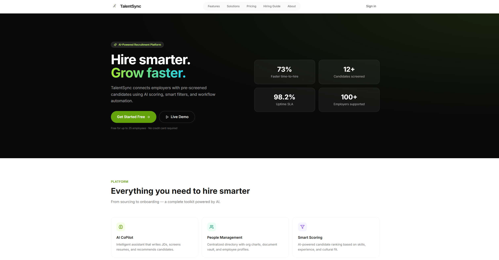
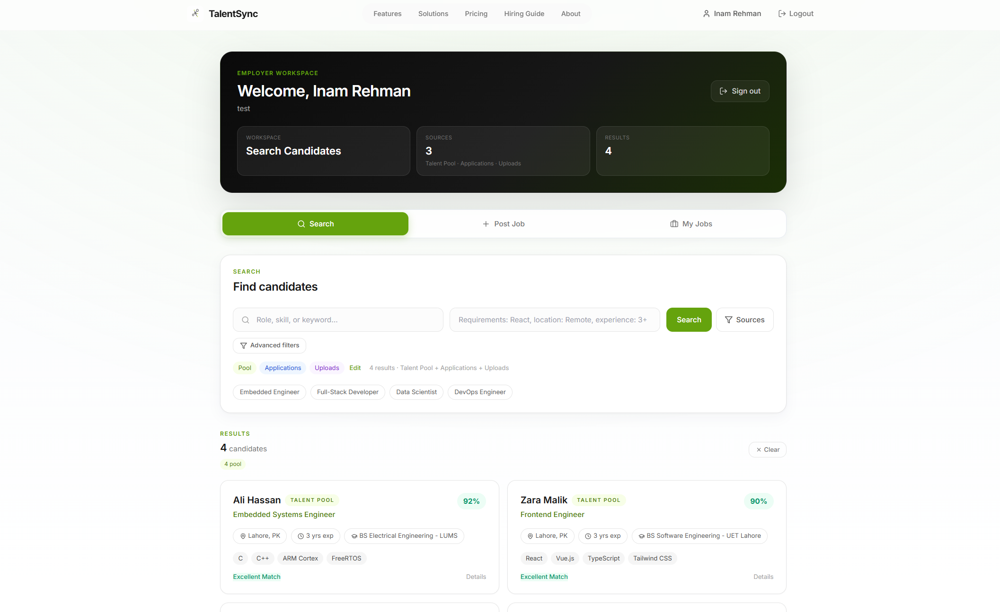
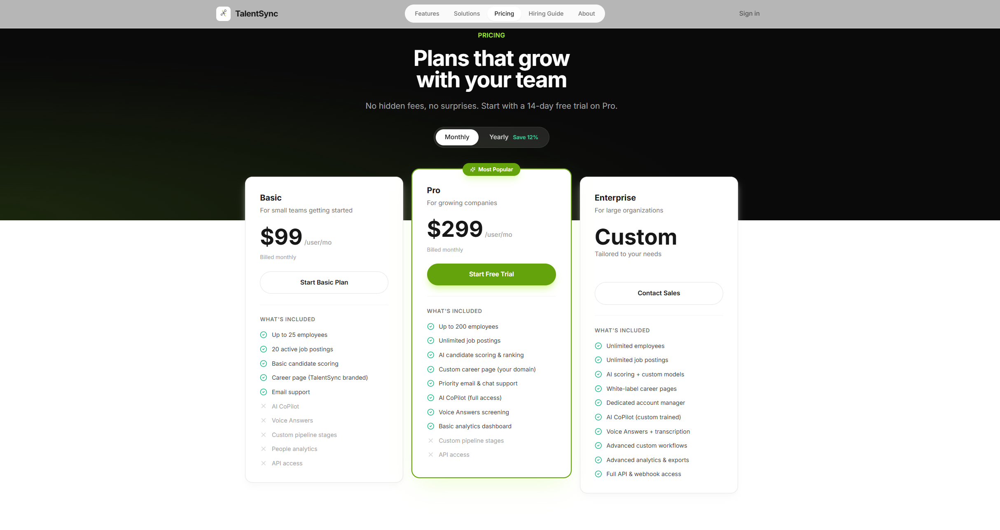
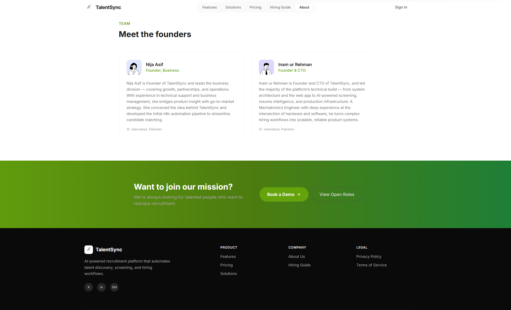
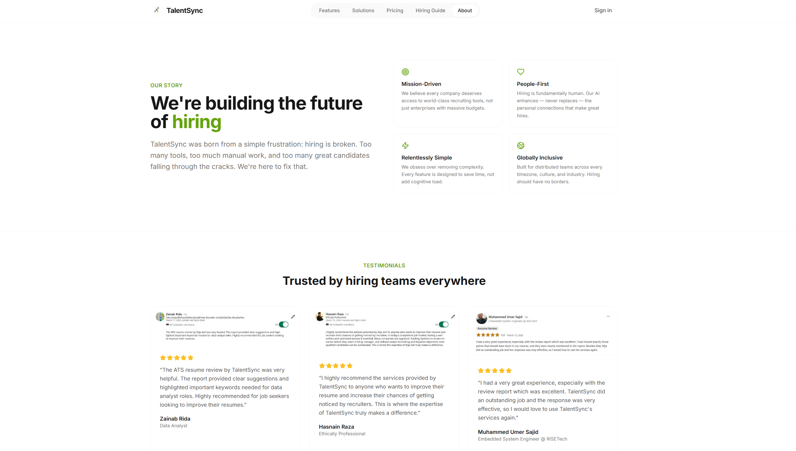

# TalentSync

## Overview

TalentSync is a comprehensive web platform designed to bridge the gap between employers and job seekers. Our mission is to simplify and automate the recruitment process, making it easier for employers to find the right talent and for candidates to discover suitable opportunities.

## Website Preview

A quick look at the TalentSync interface:

### Landing Page


### Employer Dashboard


### Resume Uploader


### AI Resume Evaluation


### Pricing


### Hiring Guide


### Team


### Testimonials


## Purpose

The primary purpose of TalentSync is to connect employers with employees by providing an intuitive, automated platform that streamlines the entire hiring lifecycle. Key objectives include:

- **Efficient Job Matching**: Utilize intelligent algorithms to match candidates with job openings based on skills, experience, and preferences.
- **Automated Workflows**: Reduce manual effort in resume screening, interview scheduling, and candidate communication.
- **User-Friendly Interface**: Offer a seamless experience for both employers and candidates through a modern, responsive web application.
- **Data-Driven Insights**: Provide analytics and insights to help employers make informed hiring decisions.

## Features

### For Employers
- **Job Posting Management**: Easily create, edit, and publish job listings with detailed requirements.
- **Candidate Discovery**: Browse and filter candidate profiles using advanced search and matching tools.
- **Application Tracking**: Monitor application status, schedule interviews, and manage the hiring pipeline.
- **Dashboard Analytics**: View metrics on job performance, candidate engagement, and hiring success rates.

### For Candidates
- **Profile Creation**: Build comprehensive profiles highlighting skills, experience, and career goals.
- **Job Search**: Discover relevant job opportunities with personalized recommendations.
- **Application Management**: Track submitted applications and receive updates on hiring progress.
- **Career Resources**: Access tips, guides, and tools to enhance job search strategies.

### Platform Features
- **Secure Authentication**: Robust login and registration system for all users.
- **Responsive Design**: Optimized for desktop, tablet, and mobile devices.
- **Real-Time Notifications**: Stay updated on application status and new opportunities.
- **Scalable Architecture**: Built with modern technologies for performance and extensibility.
- **Multi-Tenant Job Applications**: Employee applications are stored with tenant scoping so each company's resumes and applications remain partitioned by tenant.

## Technology Stack

### Frontend
- **Vue.js**: Progressive JavaScript framework for building user interfaces.
- **Vite**: Fast build tool and development server.
- **Tailwind CSS**: Utility-first CSS framework for rapid UI development.
- **Vue Router**: Official router for Vue.js applications.
- **Pinia**: Intuitive state management for Vue.js.

### Backend
- **Python Flask**: Lightweight web framework for building the API.
- **Gunicorn (Production)**: Multi-worker WSGI server for handling concurrent requests reliably.
- **CSV Data Storage**: Simple data persistence using CSV files (easily replaceable with a database in production).

### Development Tools
- **Node.js**: Runtime environment for frontend development.
- **npm**: Package manager for JavaScript dependencies.
- **Git**: Version control system.

## Installation and Setup

### Prerequisites
- Node.js (version 16 or higher)
- Python 3.8 or higher
- Git

### Backend Setup
1. Navigate to the `backend-python` directory:
   ```
   cd backend-python
   ```
2. Create a virtual environment (optional but recommended):
   ```
   python -m venv venv
   source venv/bin/activate  # On Windows: venv\Scripts\activate
   ```
3. Install Python dependencies:
   ```
   pip install -r requirements.txt
   ```
4. Run the Flask application:
   ```
   python app.py
   ```
   The backend API will be available at `http://localhost:5000`.

### Production Backend Run (Recommended)
Use Gunicorn instead of Flask's built-in development server:
```
cd backend-python
gunicorn --bind 0.0.0.0:3001 --workers 4 --threads 4 --timeout 120 app:app
```

### Frontend Setup
1. Navigate to the `frontend` directory:
   ```
   cd frontend
   ```
2. Install Node.js dependencies:
   ```
   npm install
   ```
3. Start the development server:
   ```
   npm run dev
   ```
   The frontend application will be available at `http://localhost:5173` (default Vite port).

## Usage

1. **Access the Application**: Open your web browser and navigate to the frontend URL (e.g., `http://localhost:5173`).
2. **Register/Login**: Create an account or log in as an employer or candidate.
3. **Explore Features**: Use the dashboard to post jobs, search for candidates, or find employment opportunities.
4. **Interact**: Submit applications, schedule interviews, and manage your recruitment activities.

## Project Structure

```
TalentSync/
├── backend-python/          # Python Flask backend
│   ├── app.py              # Main Flask application
│   ├── requirements.txt    # Python dependencies
│   └── data/               # CSV data files
├── frontend/               # Vue.js frontend
│   ├── src/                # Source code
│   ├── public/             # Static assets
│   └── package.json        # Node.js dependencies
├── LICENSE                 # Project license
└── README.md               # This file
```

## License

This project is licensed under the MIT License. See the [LICENSE](LICENSE) file for details.

## Contact

For questions, support, or feedback, please reach out to our development team.

---

*Built with ❤️ to revolutionize the recruitment industry.*
